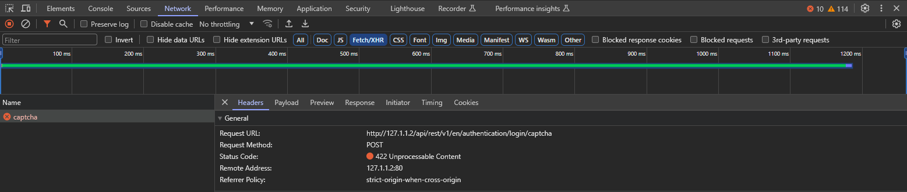
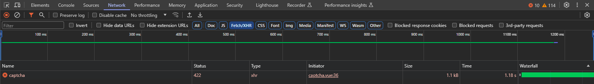

<div align="center" style="text-align: center">

# Laravel Missed API Response Wrapper 
### Super Fast | Light Weight | Standard | Octane Compatible | High Customizable
###### Built for Applications Ranging from Small to Large Scale
</div>
<br />
<div align="center" style="text-align: center">


</div>

<div align="center" style="text-align: center">


</div>

<br />
<br />

## Introduction

The **Laravel Missed API Response Wrapper** package is a high-quality and standard package that makes the process of creating and managing standard API responses in Laravel easy. This package is both fast and lightweight, and fully compatible with Laravel Octane, highly customizable, and automatically enables the standardization of all API responses. By using this package, you can easily manage errors and develop standard API services that automatically provide responses according to HTTP and REST standards. 

This package is usable anywhere, from validators to controllers and other components, and automatically provides features such as request status, message, errors, and execution time. Additionally, adding custom values to responses or disabling these features is easily achievable.

Using this package guarantees the standardization of API responses, meaning you can continuously and reliably provide high-quality responses that are easily understandable and usable for consumers of your API, while also being fully compliant with standards. All done automatically.</div>

## Installation
To install Laravel Missed API Response Wrapper, just run the following command:
```bash
composer require negartarah/apiwrapper
```
## Configuration
After installing the package, you need to publish its configuration file. To do that, run the following command:
```bash
php artisan vendor:publish --provider="Negartarh\APIWrapper\APIResponseServiceProvider"
```
This will publish the `apiwrapper.php` configuration file to your config directory and publish localization files to your `languages/vendor/apiwrapper` directory.

## Basic usage
There are two ways of utilizing the package: using the facade, or using the helper functions. Either way you will get the same result, it is totally up to you.

### Facade
#### Example 1.
```php
use Negartarh\APIWrapper\Facades\APIResponse;

...

public function index():\Illuminate\Http\Response
{
    $users = User::latest()->take(10)->get();
    
    # Alias of
    # return APIResponse::success($users);
    return APIResponse::ok($users);
}
```
### Helper functions
#### Example 1.
```php
use Negartarh\APIWrapper\Facades\APIResponse;

...

public function index():\Illuminate\Http\Response
{
    $users = User::latest()->take(10)->get();
    
    return apiwrapper()->ok($users);
    # or
    return api_response()->ok($users);
}
```
The result of the above codes is as follows:

```json
{
  "status": 200, // HTTP status code
  "message": "OK", // HTTP message
  "data": [ // Response data
    {
      "id": 1,
      ...
    },
    ...
  ],
  "errors": [], // Errors
  "execution": "13ms", // Serverside exection time
  "version": "3.2.0" // Your application version
}
```
As you can see, the simple output information has been automatically replaced with the classified information suitable for API requests. Look at the output keys, they are all changeable and editable, but before that, it is better to do more research on the package and get acquainted with its more features.

## Advanced Usage
### Automatic output based on HTTP standards
#### Example 1. Storing data
```php
use Illuminate\Support\Facades\Request;
use Negartarh\APIWrapper\Facades\APIResponse;

...

public function create(Request $request):\Illuminate\Http\Response
{
    $user = User::where('email', '=', $request->get('email'))
                  ->firstOrCreate();
                  
    return APIResponse::created($user);
}

```
The result of the above code is as follows:

```json
{
  "status": 201, // HTTP status code
  "message": "Created", // HTTP message
  "data": { // Response data
    "id": 1,
    ...
  },
  "errors": [], // Errors
  "execution": "10ms", // Serverside exection time
  "version": "3.2.0" // Your application version
}
```
#### Example 2. No content
```php
use Illuminate\Support\Facades\Request;
use Negartarh\APIWrapper\Facades\APIResponse;

...

public function index(Request $request):\Illuminate\Http\Response
{
    $posts = Post::all();
    
    if(!is_countable($posts) or count($posts) == 0):
                 
        return APIResponse::noContent();
        
    else:
        ...
}

```
The result of the above code is as follows:

```json
{
  "status": 204, // HTTP status code
  "message": "No Content", // HTTP message
  "data": [],
  "errors": [],
  "execution": "10ms",
  "version": "3.2.0"
}
```
#### Example 3. Validating data
```php
use Illuminate\Http\Exceptions\HttpResponseException;
use Negartarh\APIWrapper\Facades\APIResponse;

class ExampleCaptchaRequest extends FormRequest // example rule class
{
    ...

    /**
     * Handle a failed validation attempt.
     *
     * @param Validator $validator
     * @return HttpResponseException
     */
    public function failedValidation(Validator $validator): HttpResponseException
    {
        # based on RFC: 4918
        return APIResponse::unprocessableEntity($validator->errors());
    }
}

```
The result of the above code is as follows:

```json
{
  "status": 422, // HTTP status code
  "message": "Unprocessable Entity", // HTTP message
  "errors": {
    "captcha": [
      "The CAPTCHA has expired."
    ]
  },
  "data": [],
  "execution": "41ms",
  "version": "3.2.0"
}
```
Let’s also take a look at the server response and output headers,



everything looks great, If it is hard for you to remember the HTTP standards, no problem, pay attention to the next example.

### Alternative method
#### Example 1. Status method
```php
use Illuminate\Http\Exceptions\HttpResponseException;
use Negartarh\APIWrapper\Facades\APIResponse;

class ExampleCaptchaRequest extends FormRequest // example rule class
{
    ...

    /**
     * Handle a failed validation attempt.
     *
     * @param Validator $validator
     * @return HttpResponseException
     */
    public function failedValidation(Validator $validator): HttpResponseException
    {
        return APIResponse::status(413, $validator->errors());
    }
}

```
and the result is:

```json
{
  "status": 413,
  "message": "Request Entity Too Large",
  "errors": [
    ...
  ],
  "data": [],
  "execution": "17ms",
  "version": "3.2.0"
}
```
Wait a moment, isn't it better to customize the output message? So pay attention to the following example:

### Customized messages
#### Example 1.
```php
use Illuminate\Http\Exceptions\HttpResponseException;
use Negartarh\APIWrapper\Facades\APIResponse;

class ExampleAuthenticationRequest extends FormRequest // example rule class
{
    ...

    /**
     * Handle a failed validation attempt.
     *
     * @param Validator $validator
     * @return HttpResponseException
     */
    public function failedValidation(Validator $validator): HttpResponseException
    {
        # Alias of
        # return APIResponse::status(403, $validator->errors(), 'Where are you looking here?');
        retun APIResponse::forbidden($validator->errors(), 'What are you looking for here?');

    }
}
```
and guess the result:

```json
{
  "status": 403,
  "message": "What are you looking for here?",
  "errors": {
    ...
  },
  "data": [],
  "execution": "15ms",
  "version": "3.2.0"
}
```
But wait, there is a better solution, why not implement our own team standard? To do this, just add your own standard to the apiwrapper.php file in the config folder of your project and or make changes to it as needed.

### Customized methods
#### Example 1.
```php
# path/to/project/configuration/dir/apiwrapper.php

return [
    ...
    'methods' => [
        ...
        'accessDenied' => [
            'code' => 403,
            'message' => 'What are you looking for here?',
            'headers' => [
                'Authorization' => 'Failed',
            ],
        ],
```
and easily use the defined method in your project.

```php
use Illuminate\Support\Facades\Request;
use Negartarh\APIWrapper\Facades\APIResponse;

...

public function login(Request $request):\Illuminate\Http\Response
{
    $user = User::where('access_token', '=', $request->get('access_token'))
                  ->first();
                  
    if($user == null):
        return APIResponse::accessDenied();
    else:
        ...
}
```
If you pay attention to the above example, you will see that the header value for each status is adjustable, but what to do to adjust it at runtime? To do this, pay attention to the following example:

### Adjustable headers
#### Example 1.
```php
use Illuminate\Support\Facades\Request;
use Negartarh\APIWrapper\Facades\APIResponse;

...

public function login(Request $request):\Illuminate\Http\Response
{
    $user = User::where('access_token', '=', $request->get('access_token'))
                  ->first();
                  
    if($user == null):
        return APIResponse::accessDenied($user, headers: [
                    ...
               ]);
        # or 
        return APIResponse::accessDenied($user)
               ->withHeaders([ ... ]);
    else:
        ...
}
```
## Localization
If your API is multilingual, this package is translatable and has been translated into `Persian`, `Arabic` and `Turkish`. To work with translations, refer to the Laravel documents. for more information, pay attention to the next example:

#### Example 1. Localized response
```php
use Negartarh\APIWrapper\Facades\APIResponse;

...
App::setLocale('fa');
...

return APIResponse::insufficientStorage();
```
and the result:

```json
{
  "status": 507,
  "message": "فضای ذخیره سازی ناکافی",
  ...
}
```
If you do not need to translate the messages, you can disable it through the configuration file.
#### Example 2. Disabling localization
```php
# path/to/project/configuration/dir/apiwrapper.php

return [
    ...
    'localization' => false,
```
## Sorting Responses
If you wish to further standardize your responses, you can sort them alphabetically. You can achieve this by using the 'sort' key in the configuration file. By setting this key to true, your responses will be sorted alphabetically. The default state of this option is false.
#### Example 1. Enabling sorting responses
```php
# path/to/project/configuration/dir/apiwrapper.php

return [
    ...
    'sort' => true,
```

## Customizing responses
To enable, disable or customize default keys in the response, just do it through the configuration file.
#### Example 1. Disabling default keys
```php
# path/to/project/configuration/dir/apiwrapper.php

return [
    ...
    'fields' => [
        ...
        'execution' => false,
```
#### Example 2. change the algorithm
```php
# path/to/project/configuration/dir/apiwrapper.php

return [
    ...
    'fields' => [
        ...
        'version' => fn(mixed $content, int $status, string $message) => env('API_VERSION', 'x.x.x'),
        or
        'version' => 'Namespace\Of\Custom\Class::static_method', //recommended
        or
        'version' => 'any_callable_function',
```
You can get more information on this by studying the configuration file.


## Changing the default key names
Like the previous examples, to change the default key names in the response, just do it through the configuration file.
#### Example 1.
```php
# path/to/project/configuration/dir/apiwrapper.php

return [
    ...
    'replaces' => [
        ...
        'data' => 'content',
```
result:
```json
{
  "status": 200,
  "message": "OK",
  "content": [ // changed from data to content
    {
      "id": 1,
      ...
    },
    ...
  ],
  "errors": [],
  "execution": "7ms",
  "version": "3.2.0"
}
```

## Adding custom values
To add custom values to the API response, do the following in the configuration file.
#### Example 1.
```php
# path/to/project/configuration/dir/apiwrapper.php

return [
    ...
    'custom_keys'=>[
        'app'=> 'My Wonderful APP',
        ...
        'time'=> fn(mixed $content, int $status, string $message) => \Illuminate\Support\Carbon::now(),
        or
        'time' => 'Namespace\Of\Custom\Class::static_method', //recommended
        or
        'time' => 'any_callable_function',
```
and the result:
```json
{
  "status": 200,
  ...
  "app": "My Wonderful APP",
  "time": "2024-01-05T02:42:10.636571Z"
}
```

## Hints
#### Example 1. Real-World software development with axios
###### Back-End:
```php
# API Login Controller
use Negartarh\APIWrapper\Facades\APIResponse;

...

    public function login(LoginRequest $request):\Illuminate\Http\Response
    {
        ...
        
        return APIResponse::ok([
                ...
            ]);
    }

# API LoginRequest Form Request
use Negartarh\APIWrapper\Facades\APIResponse;

...

    public function failedValidation(Validator $validator): HttpResponseException
    {
        return APIResponse::unprocessableEntity($validator->errors());
    }
```
###### Front-End:
```js
let isOnRequest = false;

...

async function submitForm() {

    isOnRequest = true;

    await axios.post('api/login', {
        ...
    })
    .then((response) => {
        // if validation passed, you can get response here
        console.log(response.data)
    }).catch((error)=>{
        // if validation failed, you can catch errors here
        console.log(error.response.data)
    }).finally(()=>{
        isOnRequest = false;
    });
}
```
#### Example 2. Handle 404 status in api responses
```php
# app/Exceptions/Handler.php

class Handler extends ExceptionHandler
{
    ...
    
        public function register()
        {
            $this->reportable( function ( Throwable $e ) {
                //
            } );
    
            $this->renderable(function (NotFoundHttpException $e, Request $request) {
                if ($request->is('api/*')):
                    return APIResponse::status(404);
                endif;
            });
    
        }

```


## Built-in methods
In the table below, the predefined methods are given with the HTTP code and message text. All these values are accessible and changeable through the config file.

| No. |            METHOD            | HTTP STATUS  |             MESSAGE             |
|:---:|:----------------------------:| :---: |:-------------------------------:|
| #0  |              ok              | 200 |               OK                |
| #1  |           success            | 200 |             Success             |
| #2  |           created            | 201 |             Created             |
| #3  |           accepted           | 202 |            Accepted             |
| #4  | nonAuthoritativeInformation  | 203 |  Non Authoritative Information  |
| #5  |          noContent           | 204 |           No Content            |
| #6  |         resetContent         | 205 |          Reset Content          |
| #7  |        partialContent        | 206 |         Partial Content         |
| #8  |         multiStatus          | 207 |          Multi Status           |
| #9  |       alreadyReported        | 208 |        Already Reported         |
| #10 |            imUsed            | 226 |             IM Used             |
| #11 |       multipleChoices        | 300 |        Multiple Choices         |
| #12 |       movedPermanently       | 301 |        Moved Permanently        |
| #13 |            found             | 302 |              Found              |
| #14 |           seeOther           | 303 |            See Other            |
| #15 |         notModified          | 304 |          Not Modified           |
| #16 |           useProxy           | 305 |            Use Proxy            |
| #17 |      temporaryRedirect       | 307 |       Temporary Redirect        |
| #18 |      permanentRedirect       | 308 |       Permanent Redirect        |
| #19 |          badRequest          | 400 |           Bad Request           |
| #20 |         unauthorized         | 401 |          Unauthorized           |
| #21 |       paymentRequired        | 402 |        Payment Required         |
| #22 |          forbidden           | 403 |            Forbidden            |
| #23 |           notFound           | 404 |            Not Found            |
| #24 |       methodNotAllowed       | 405 |       Method Not Allowed        |
| #25 |        notAcceptable         | 406 |         Not Acceptable          |
| #26 | proxyAuthenticationRequired  | 407 |  Proxy Authentication Required  |
| #27 |        requestTimeout        | 408 |         Request Timeout         |
| #28 |           conflict           | 409 |            Conflict             |
| #29 |             gone             | 410 |              Gone               |
| #30 |        lengthRequired        | 411 |         Length Required         |
| #31 |      preconditionFailed      | 412 |       Precondition Failed       |
| #32 |    requestEntityTooLarge     | 413 |    Request Entity Too Large     |
| #33 |      requestURITooLong       | 414 |      Request URI Too Long       |
| #34 |     unsupportedMediaType     | 415 |     Unsupported Media Type      |
| #35 | requestedRangeNotSatisfiable | 416 | Requested Range Not Satisfiable |
| #36 |      expectationFailed       | 417 |       Expectation Failed        |
| #37 |     unprocessableEntity      | 422 |      Unprocessable Entity       |
| #38 |            locked            | 423 |             Locked              |
| #39 |       failedDependency       | 424 |        Failed Dependency        |
| #40 |           tooEarly           | 425 |            Too Early            |
| #41 |       upgradeRequired        | 426 |        Upgrade Required         |
| #42 |     preconditionRequired     | 428 |      Precondition Required      |
| #43 |       tooManyRequests        | 429 |        Too Many Requests        |
| #44 | requestHeaderFieldsTooLarge  | 431 | Request Header Fields Too Large |
| #45 |          noResponse          | 444 |           No Response           |
| #46 |  unavailableForLegalReasons  | 451 |  Unavailable For Legal Reasons  |
| #47 |     internalServerError      | 500 |      Internal Server Error      |
| #48 |        notImplemented        | 501 |         Not Implemented         |
| #49 |          badGateway          | 502 |           Bad Gateway           |
| #50 |      serviceUnavailable      | 503 |       Service Unavailable       |
| #51 |        gatewayTimeout        | 504 |         Gateway Timeout         |
| #52 |   httpVersionNotSupported    | 505 |   HTTP Version Not Supported    |
| #53 |    variantAlsoNegotiates     | 506 |     Variant Also Negotiates     |
| #54 |     insufficientStorage      | 507 |      Insufficient Storage       |
| #55 |         loopDetected         | 508 |          Loop Detected          |
| #56 |         notExtended          | 510 |          Not Extended           |
| #57 | networkAuthenticationRequire | 511 | Network Authentication Require  |


## Requirments
* php: >= 8.1
* illuminate/support: *

## Contributing
We will be happy if we see PR from you.

## License
This is a free package released under the MIT License.
